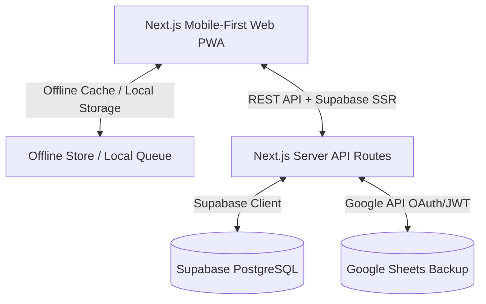

# Implementation Plan - Ganesh Printers Billing Management System

This is a modern, mobile-first billing management system for **Ganesh Printers**. It is designed to digitize manual notebook workflows into a clean, fast, and secure database.

## System Architecture



## Data Sync Logic

1. **Online Flow**:
   - Client sends mutation request to local Next.js API Routes (`/api/places` or `/api/bills`).
   - Server performs transaction on Supabase database.
   - Server simultaneously invokes Google Sheets API to write/sync the change.
   - Logs the operation to the `activity_logs` table and Google Sheets activity tab.
   - Returns success response to client.

2. **Offline-First Flow**:
   - If client is offline, operations are queued in `localStorage`.
   - UI updates optimistically, showing pending changes with a "Syncing..." status.
   - A Service Worker / Online Listener detects when connectivity is restored.
   - Client replays all queued actions sequentially to the Server API.

## Directory Structure

```text
billing-app/
├── public/
│   ├── icon-192x192.png       # PWA Icons
│   ├── icon-512x512.png
│   └── manifest.json          # PWA Manifest
├── src/
│   ├── app/
│   │   ├── api/
│   │   │   ├── places/        # Place endpoints (CRUD + Sync)
│   │   │   │   └── route.ts
│   │   │   ├── bills/         # Bill endpoints (CRUD + Sync)
│   │   │   │   └── route.ts
│   │   │   └── dashboard/     # Overall summary stats
│   │   │       └── route.ts
│   │   ├── dashboard/         # Admin dashboard page
│   │   │   └── page.tsx
│   │   ├── places/
│   │   │   ├── page.tsx       # Places listing & selection
│   │   │   └── [id]/          # Place detail & bill management
│   │   │       └── page.tsx
│   │   ├── login/
│   │   │   └── page.tsx       # Supabase Auth page
│   │   ├── layout.tsx         # Mobile-first wrapper, bottom nav, state
│   │   ├── page.tsx           # Entry (auth check + redirect)
│   │   └── globals.css        # Global CSS & Tailwind configuration
│   ├── components/
│   │   ├── ui/                # Shadcn Components
│   │   └── offline-sync.tsx   # Offline status banner & queue processor
│   ├── lib/
│   │   ├── supabase.ts        # Supabase SSR and Client definitions
│   │   ├── google-sheets.ts   # Google Sheets service
│   │   ├── pdf-export.ts      # PDF generator
│   │   └── offline-store.ts   # LocalStorage store for offline sync
```

## Step-by-Step Implementation

1. **Step 1: Configuration & Env Variables**
   - Create `.env.local` containing Supabase URL, Anon Key, Service Role Key, and Google API Credentials.
2. **Step 2: Supabase Server and Client Setup**
   - Implement `supabase.ts` for database connectivity.
3. **Step 3: Google Sheets API Connection Service**
   - Implement `google-sheets.ts` to push modifications to target sheets in real time.
4. **Step 4: PWA Manifest & Setup**
   - Create PWA manifest and registers service worker to support standard installs on Android and iOS.
5. **Step 5: Next.js API Routes**
   - Implement `api/places/route.ts` and `api/bills/route.ts` with error handling, validation, and Sheets sync logic.
6. **Step 6: Offline Storage Helper**
   - Build client-side local sync utilities.
7. **Step 7: UI Pages & Components**
   - Build places selection screen with instant sorting and filtering.
   - Build individual Place Dashboard screen.
   - Build Pending & Completed Bills views.
   - Build Admin Dashboard and activity tracking.
   - Build PDF Export handler.
8. **Step 8: Final Testing**
   - Ensure the application is visually breathtaking, completely optimized for mobile, responsive, and robust under simulated network dropouts.
